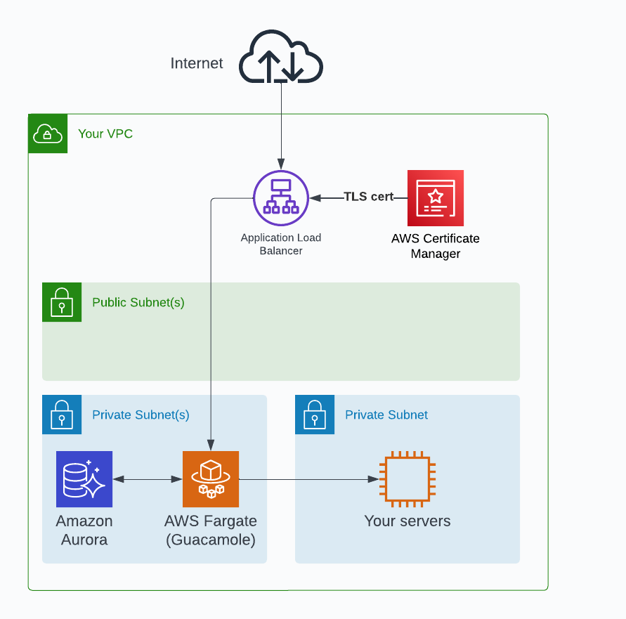

# Guacamole on Fargate Terraform Module

This Terraform module deploys an Apache Guacamole using all serverless components.
Fargate is used for Guacamole and Aurora is used for the database. The setup is
configured to scale as usage increases.

This module involves the use of a local provisioner to initialize the Guacamole databse.
In order for this local provisioner to work, ensure you have the following tools installed
on your system:

  - AWS CLI
  - Docker
  - sed
  - awk
  - sha256sum (or shasum for MacOS)
  - openssl

This module has was developed and tested on an Ubuntu system.

## Requirements

| Name | Version |
|------|---------|
|  [terraform](#requirement\_terraform) | >= 1.0.0 |
|  [aws](#requirement\_aws) | >=5.0.0 |

## Providers

| Name | Version |
|------|---------|
|  [aws](#provider\_aws) | >=5.0.0 |
|  [null](#provider\_null) | n/a |
|  [random](#provider\_random) | n/a |

## Modules

| Name | Source | Version |
|------|--------|---------|
|  [acm](#module\_acm) | terraform-aws-modules/acm/aws | 5.0.0 |

## Resources

| Name | Type |
|------|------|
| [aws_appautoscaling_policy.guacamole_policy](https://registry.terraform.io/providers/hashicorp/aws/latest/docs/resources/appautoscaling_policy) | resource |
| [aws_appautoscaling_target.guacamole_target](https://registry.terraform.io/providers/hashicorp/aws/latest/docs/resources/appautoscaling_target) | resource |
| [aws_cloudwatch_log_group.guacamole_log_group](https://registry.terraform.io/providers/hashicorp/aws/latest/docs/resources/cloudwatch_log_group) | resource |
| [aws_db_subnet_group.guacamole](https://registry.terraform.io/providers/hashicorp/aws/latest/docs/resources/db_subnet_group) | resource |
| [aws_ecs_cluster.fargate_cluster](https://registry.terraform.io/providers/hashicorp/aws/latest/docs/resources/ecs_cluster) | resource |
| [aws_ecs_service.guacamole](https://registry.terraform.io/providers/hashicorp/aws/latest/docs/resources/ecs_service) | resource |
| [aws_ecs_task_definition.guacamole](https://registry.terraform.io/providers/hashicorp/aws/latest/docs/resources/ecs_task_definition) | resource |
| [aws_iam_policy.ecs_task_execution_policy](https://registry.terraform.io/providers/hashicorp/aws/latest/docs/resources/iam_policy) | resource |
| [aws_iam_role.ecs_execution_role](https://registry.terraform.io/providers/hashicorp/aws/latest/docs/resources/iam_role) | resource |
| [aws_iam_role.ecs_task_role](https://registry.terraform.io/providers/hashicorp/aws/latest/docs/resources/iam_role) | resource |
| [aws_iam_role_policy_attachment.ecs_execution_role_policy](https://registry.terraform.io/providers/hashicorp/aws/latest/docs/resources/iam_role_policy_attachment) | resource |
| [aws_iam_role_policy_attachment.ecs_task_role_policy](https://registry.terraform.io/providers/hashicorp/aws/latest/docs/resources/iam_role_policy_attachment) | resource |
| [aws_iam_role_policy_attachment.secret_access_attachment](https://registry.terraform.io/providers/hashicorp/aws/latest/docs/resources/iam_role_policy_attachment) | resource |
| [aws_lb.guacamole_lb](https://registry.terraform.io/providers/hashicorp/aws/latest/docs/resources/lb) | resource |
| [aws_lb_listener.http](https://registry.terraform.io/providers/hashicorp/aws/latest/docs/resources/lb_listener) | resource |
| [aws_lb_listener.http_redirect](https://registry.terraform.io/providers/hashicorp/aws/latest/docs/resources/lb_listener) | resource |
| [aws_lb_listener.https](https://registry.terraform.io/providers/hashicorp/aws/latest/docs/resources/lb_listener) | resource |
| [aws_lb_listener_rule.redirect_root](https://registry.terraform.io/providers/hashicorp/aws/latest/docs/resources/lb_listener_rule) | resource |
| [aws_lb_target_group.guacamole_tg](https://registry.terraform.io/providers/hashicorp/aws/latest/docs/resources/lb_target_group) | resource |
| [aws_rds_cluster.guacamole_db](https://registry.terraform.io/providers/hashicorp/aws/latest/docs/resources/rds_cluster) | resource |
| [aws_route53_record.guacamole](https://registry.terraform.io/providers/hashicorp/aws/latest/docs/resources/route53_record) | resource |
| [aws_secretsmanager_secret.guacamole_db_credentials](https://registry.terraform.io/providers/hashicorp/aws/latest/docs/resources/secretsmanager_secret) | resource |
| [aws_secretsmanager_secret_version.guacamole_db_credentials](https://registry.terraform.io/providers/hashicorp/aws/latest/docs/resources/secretsmanager_secret_version) | resource |
| [aws_security_group.alb_sg](https://registry.terraform.io/providers/hashicorp/aws/latest/docs/resources/security_group) | resource |
| [aws_security_group.ecs_sg](https://registry.terraform.io/providers/hashicorp/aws/latest/docs/resources/security_group) | resource |
| [aws_security_group.rds_sg](https://registry.terraform.io/providers/hashicorp/aws/latest/docs/resources/security_group) | resource |
| [null_resource.db_init](https://registry.terraform.io/providers/hashicorp/null/latest/docs/resources/resource) | resource |
| [random_password.guacamole_db_password](https://registry.terraform.io/providers/hashicorp/random/latest/docs/resources/password) | resource |
| [random_password.random_id](https://registry.terraform.io/providers/hashicorp/random/latest/docs/resources/password) | resource |
| [aws_rds_engine_version.postgresql](https://registry.terraform.io/providers/hashicorp/aws/latest/docs/data-sources/rds_engine_version) | data source |
| [aws_region.current](https://registry.terraform.io/providers/hashicorp/aws/latest/docs/data-sources/region) | data source |
| [aws_route53_zone.zone](https://registry.terraform.io/providers/hashicorp/aws/latest/docs/data-sources/route53_zone) | data source |
| [aws_subnet.private_subnets](https://registry.terraform.io/providers/hashicorp/aws/latest/docs/data-sources/subnet) | data source |
| [aws_subnet.temp](https://registry.terraform.io/providers/hashicorp/aws/latest/docs/data-sources/subnet) | data source |
| [aws_vpc.this](https://registry.terraform.io/providers/hashicorp/aws/latest/docs/data-sources/vpc) | data source |

## Inputs

| Name | Description | Type | Default | Required |
|------|-------------|------|---------|:--------:|
|  [db\_skip\_final\_snapshot](#input\_db\_skip\_final\_snapshot) | Whether to skip final snapshot when Aurora DB is destroyed | `bool` | `true` | no |
|  [guac\_image\_uri](#input\_guac\_image\_uri) | ARN of custom Guacamole image to use. If not provided, will use latest version of guacamole/guacamole | `string` | `""` | no |
|  [guacadmin\_password](#input\_guacadmin\_password) | Password for guacadmin user (a new random salt will be generated) | `string` | n/a | yes |
|  [guacamole\_task\_environment\_vars](#input\_guacamole\_task\_environment\_vars) | Environment variables to pass to Guacamole task (database environment variables are automatically passed). Should be list of dictionaries with keys `name` and `value`. | `list(map(string))` | `[]` | no |
|  [guacamole\_task\_security\_groups](#input\_guacamole\_task\_security\_groups) | IDs of security groups to attach to Guacamole ECS task | `list(string)` | `[]` | no |
|  [hosted\_zone\_name](#input\_hosted\_zone\_name) | If provided, will create DNS record in this hosted zone for load balancer. This hosted zone name must be for the same zone as the certificate. | `string` | `""` | no |
|  [maximum\_guacamole\_task\_count](#input\_maximum\_guacamole\_task\_count) | Maximum number of Guacamole tasks to run at once | `number` | `10` | no |
|  [private\_subnets](#input\_private\_subnets) | Subnets to place Fargate and Aurora in | `list(string)` | n/a | yes |
|  [public\_subnets](#input\_public\_subnets) | Subnets to place load balancer in | `list(string)` | n/a | yes |
|  [subdomain](#input\_subdomain) | Subdomain within hosted zone to create DNS record for load balancer. | `string` | `""` | no |
|  [use\_http\_only](#input\_use\_http\_only) | Whether to use HTTP only for load balancer (should just be for evaluating the module and automated tested) | `bool` | `false` | no |

## Outputs

| Name | Description |
|------|-------------|
|  [guacamole\_url](#output\_guacamole\_url) | URL of Guacamole instance |
